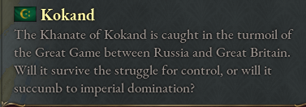
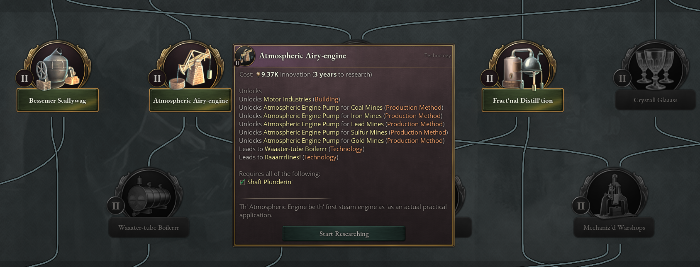
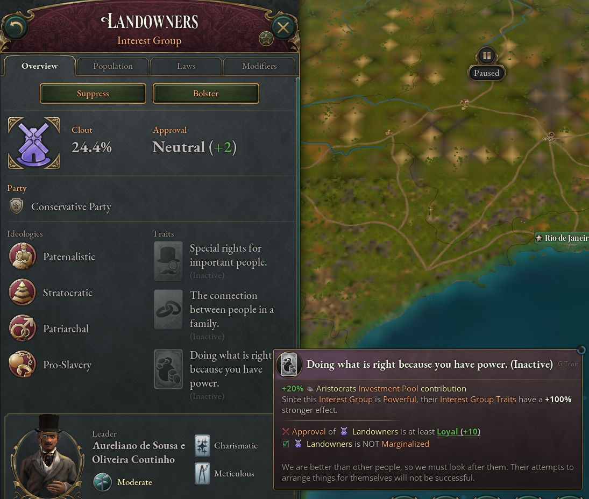
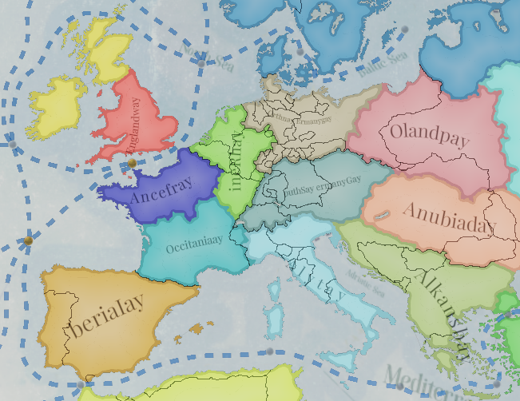

# Victoria 3 Artificial Flavor Mod

This is a project to add flavor to Victoria 3 using OpenAI that I created while learning how to use OpenAI. In the Mods folder are several flavor mods created using AI. You
can also make your own mods by re-running my code with different prompts.

## Mods
Country Description Flavor:
* Generates unique, new country descriptions using AI for all countries (up from 83).
* Some country descriptions are really good! They include nuanced historical details from the time that would surprise an amateur historian.
* Some country descriptions are hilariously wrong. These are generally the tags for which not much is known.
* Some country descriptions may include events that happened after 1836.

Pirate-Theme'd Inventions
* Changes the text for inventions to pirate
* Some descriptions have two words mashed together. This is due to the AI getting confused on small prompts

Basic English Interest Group Traits
* Changes interest group traits to [basic english](https://en.wikipedia.org/wiki/Basic_English)
* Some descriptions have two words mashed together. This is due to the AI getting confused on small prompts

Igpay Atinlay Eategicstay Egionsray
* Changes the text for strategic regions to pig latin

Pirate-Theme'd Speech Alerts
* Changes alerts to pirate speech
* Example of how OpenAI can rewrite text with code in it, with a modified prompt. 'rewrite in pirate speech. Do not change words with special characters'
* This was a very simple attempt to use OpenAI to write code. I will likely revisit this in the future when I have more time.

## Make your own mod!
Note: This require an OpenAI API Key, which you can get for free [here](https://openai.com/api/). It comes with $18 of credit. Remember to set your api key to your python enviroment.
Note 2: Sometimes there are issues with the OpenAI server. I've added a bandaid fix, but it may not always work.
### Style Transfer
Do you want to make a flavor mod where everything is written like a James Bond movie, or maybe translate the game to Esperanto?
Simply run translate_localization() in style_transfer.py, with your chosen prompt, and add to a mod folder.

parameters: 
prompt: e.g. 'convert to pirate speech'
file_paths_to_translate: e.g. file_paths_to_translate = ['C:\\Program Files (x86)\\Steam\\steamapps\\common\\Victoria 3\\game\\localization\\english\\alerts_l_english.yml']
mod_directory: e.g. "../NEW MOD/"
temperature: how much randomness is in AI reponse

Note: I need to add an option to deal with special characters

### Content Generation
Currently not available. I need to retool this for easy re-use. Probable future pipeline: Insert path, AI uses existing text to generate new text.

## Other
I played around with fine-tuning, but ultimately did not find it useful for this project. Fine tuning allows you to skip prompts, which can be very useful.

## Disclaimer / Credits
* Made Using OpenAI's API (Thank you)
* Some content may not be appropriate for all audiences. Content was generated by AI and not rigorously checked. If there is inappropriate content, let me know
